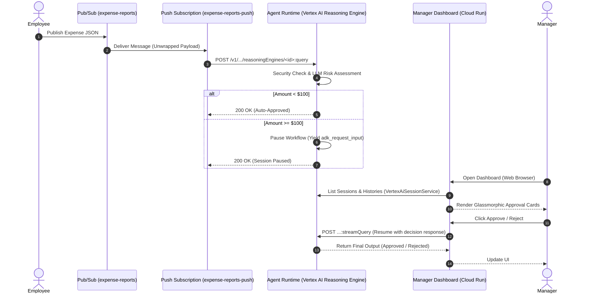

# Ambient Expense Triage Agent & Pipeline

This repository contains the source code for the **Ambient Expense Reporting Agent**, an event-driven serverless pipeline built with the Google Agent Development Kit (ADK), deployed on Vertex AI Agent Engine (Reasoning Engine), and integrated with a human-in-the-loop Manager Approval Dashboard.

## System Architecture

The pipeline processes incoming raw expense report events asynchronously, automatically triaging them based on policy and expense thresholds.



### Triaging Logic
1. **Low-Value Expenses (< $100)**: Instantly auto-approved without LLM evaluation.
2. **Security Checkpoint**: Scrubs any SSNs or credit card numbers from the description, and guards against prompt injections. If prompt injection is detected, the LLM is bypassed and the item is directly flagged for manual review.
3. **High-Value Expenses (>= $100)**: Evaluated by `gemini-3.1-flash-lite` for vague descriptions, compliance warnings, or weekend charges. The workflow then pauses and requests input (`adk_request_input` callback).
4. **Human Review**: The session state is suspended. Managers can approve or reject the expense on the dashboard, which triggers session resumption and yields final approval/rejection results.

---

## Getting Started

### 1. Prerequisites
Ensure you have the following CLI tools installed:
* [uv](https://docs.astral.sh/uv/) (Astral's fast Python packaging tool)
* [google-agents-cli](https://github.com/google-gemini/google-agents-cli) (Install via `uv tool install google-agents-cli`)
* [gcloud CLI](https://cloud.google.com/sdk/docs/install) (Authenticated and configured to your active GCP project)

---

## Deployment Walkthrough

### Phase 1: Deploy the Agent Runtime (Vertex AI Reasoning Engine)

Initialize local dependencies:
```bash
agents-cli install
```

Configure your gcloud active project:
```bash
gcloud config set project <your-project-id>
```

Deploy the agent code to Vertex AI:
```bash
uv run agents-cli deploy --no-wait --no-confirm-project
```

Track the deployment status:
```bash
uv run agents-cli deploy --status
```
Once successful, note down your **Agent Runtime ID** (formatted as: `projects/<project>/locations/us-central1/reasoningEngines/<engine-id>`).

---

### Phase 2: Configure the Pub/Sub Event Pipeline

1. **Create the main topic and the dead-letter topic:**
   ```bash
   gcloud pubsub topics create expense-reports
   gcloud pubsub topics create expense-reports-dead-letter
   ```

2. **Create the Invoker Service Account:**
   ```bash
   gcloud iam service-accounts create pubsub-invoker \
     --display-name="Pub/Sub Agent Invoker"
   ```

3. **Grant permission to the service account to query the agent:**
   ```bash
   gcloud projects add-iam-policy-binding <your-project-id> \
     --member="serviceAccount:pubsub-invoker@<your-project-id>.iam.gserviceaccount.com" \
     --role="roles/aiplatform.user"
   ```

4. **Create the push subscription** directly hitting the Agent Runtime `:query` REST endpoint. Set the ack deadline to 10 minutes (`600s`), deliver 5 retries max before dead-lettering, and use `--push-no-wrapper` so the raw payload is delivered as the POST body:
   ```bash
   gcloud pubsub subscriptions create expense-reports-push \
     --topic=expense-reports \
     --push-endpoint="https://us-central1-aiplatform.googleapis.com/v1/projects/<your-project-number>/locations/us-central1/reasoningEngines/<engine-id>:query" \
     --push-no-wrapper \
     --ack-deadline=600 \
     --dead-letter-topic=expense-reports-dead-letter \
     --max-delivery-attempts=5 \
     --push-auth-service-account="pubsub-invoker@<your-project-id>.iam.gserviceaccount.com"
   ```

---

### Phase 3: Build & Deploy the Manager Dashboard

The standalone manager dashboard is a FastAPI service located in `submission_frontend/`.

1. **Test the Dashboard Locally:**
   Set the required variables in your shell environment and start the service:
   ```bash
   export GOOGLE_CLOUD_PROJECT="<your-project-id>"
   export AGENT_RUNTIME_ID="projects/<project-number>/locations/us-central1/reasoningEngines/<engine-id>"
   
   uv run python submission_frontend/main.py
   ```
   Open `http://localhost:8000` to interact with the dashboard.

2. **Deploy to Cloud Run:**
   Submit the build and deploy to Google Cloud Run:
   ```bash
   gcloud run deploy expense-manager-dashboard \
     --source=submission_frontend \
     --region=us-central1 \
     --set-env-vars="GOOGLE_CLOUD_PROJECT=<your-project-id>,AGENT_RUNTIME_ID=projects/<project-number>/locations/us-central1/reasoningEngines/<engine-id>" \
     --allow-unauthenticated
   ```
   Note down the returned **Service URL** of your deployed dashboard.

---

## Verifying & Testing

### 1. Test Auto-Approval (Expense under $100)
Publish an expense event for **$45**:
```bash
gcloud pubsub topics publish expense-reports \
  --message='{"input": {"message": "{\"amount\": 45, \"submitter\": \"bob@company.com\", \"category\": \"meals\", \"description\": \"Team lunch\", \"date\": \"2026-04-12\"}"}}'
```

Read the reasoning engine logs. You will see it was instantly auto-approved without requesting human input:
```bash
gcloud logging read 'resource.type="aiplatform.googleapis.com/ReasoningEngine"' --limit=20
```

### 2. Test Manual Approval (Expense >= $100)
Publish an expense event for **$150**:
```bash
gcloud pubsub topics publish expense-reports \
  --message='{"input": {"message": "{\"amount\": 150, \"submitter\": \"bob@company.com\", \"category\": \"meals\", \"description\": \"Team dinner\", \"date\": \"2026-04-12\"}"}}'
```

1. Open your deployed **Manager Dashboard** URL.
2. You will see an interactive card displaying Bob's pending dinner expense, along with compliance analysis details generated by the LLM (e.g., alert flags for vague description and weekend charge).
3. Click **Approve** or **Reject** to resume the workflow run and record the manager decision!
